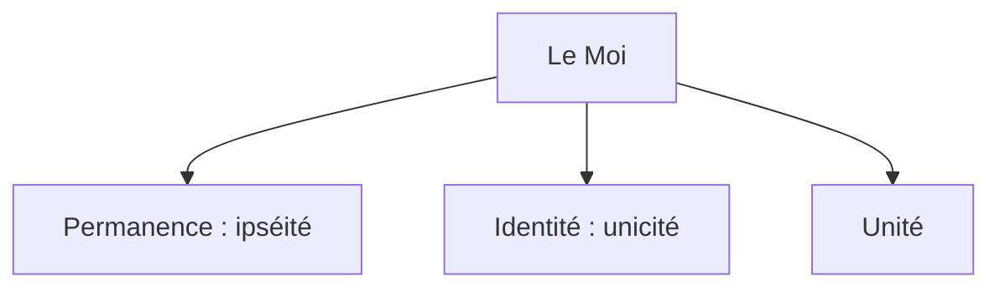

# Introduction : Le problème de l'identité personnelle
{: .no_toc }

<details open markdown="block">
  <summary>
    Sommaire
  </summary>
  {: .text-delta }
- TOC
{:toc}
</details>

```
NOTION PRINCIPALE : LA CONSCIENCE
```

## Vidéo introductive

**TED-ed : Qui suis-je ? Une quête philosophique - Amy Adkins (sous-titres disponibles)**  

<iframe width="560" height="315" src="https://www.youtube.com/embed/UHwVyplU3Pg?si=haBymrcR48sE2Htw" title="YouTube video player" frameborder="0" allow="accelerometer; autoplay; clipboard-write; encrypted-media; gyroscope; picture-in-picture; web-share" referrerpolicy="strict-origin-when-cross-origin" allowfullscreen></iframe>

## Le paradoxe du bateau de Thésée

### Texte

| Plutarque (46 – 125), _Vie de Thésée_       |
| -------------------------------- |
| Le vaisseau sur lequel Thésée s’était embarqué avec les autres jeunes gens, et qu’il ramena heureusement à Athènes, était une galère à trente rames, que les Athéniens conservèrent jusqu’au temps de Démétrios de Phalère. Ils en ôtaient les vieilles pièces, à mesure qu’elles se gâtaient, et les remplaçaient par des neuves qu’ils joignaient solidement aux anciennes. Aussi les philosophes, en se disputant sur ce genre de sophisme (…), citent ce vaisseau comme un exemple de doute, et soutiennent les uns que c’était toujours le même, les autres que c’était un vaisseau différent. |
| *Appliquez le paradoxe du bateau de Thésée à la question « Qui suis-je ? » et formulez le problème de l’identité personnelle.*     |

### Vidéo

<iframe width="560" height="315" src="https://www.youtube.com/embed/PWud6qbSwug?si=H6uTFIyyvDvC028y" title="YouTube video player" frameborder="0" allow="accelerometer; autoplay; clipboard-write; encrypted-media; gyroscope; picture-in-picture; web-share" referrerpolicy="strict-origin-when-cross-origin" allowfullscreen></iframe>

## Les caractéristiques du Moi



{: .highlight }
→ Ouvrir la [carte mentale sur l'identité du Moi](https://profauda.fr/schemas/cartes/moi.html){:target="_blank" } 