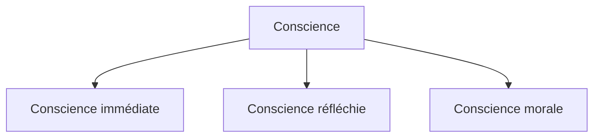

# 1. Je suis une chose qui pense
{: .no_toc }

<details open markdown="block">
  <summary>
    Sommaire
  </summary>
  {: .text-delta }
- TOC
{:toc}
</details>

```
NOTION PRINCIPALE : LA CONSCIENCE
```

## 1.1. Conscience immédiate et conscience de soi

```
NOTION COMPLÉMENTAIRE : LA NATURE
```

| Georg Wilhelm Friedrich HEGEL, Esthétique      |
| --------------------------------------------------------- |
| Les choses de la nature n'existent qu'immédiatement et d'une seule façon, tandis que l'homme, parce qu'il est esprit a une double existence ; il existe d'une part au même titre que les choses de la nature, mais d'autre part, il existe aussi pour soi. Il se contemple, se représente à lui-même, se pense et n'est esprit que par cette activité qui constitue un être pour soi. |
| *Expliquez ce qui nous distingue des autres animaux (« les choses de la nature »)*        |



{: .highlight }
→ Ouvrir la [carte mentale sur la conscience](https://profauda.fr/schemas/cartes/conscience.html){:target="_blank" } 

## 1.2. Descartes : « Je pense donc je suis »

```
NOTIONS COMPLÉMENTAIRES : LA VÉRITÉ, LA RAISON
```

### Textes

| René Descartes, _Discours de la méthode_ (1637)   |
| ------------------------------------------------ |
| **[#1]** Je ne sais si je dois vous entretenir des premières méditations que j’ai faites ; car elles sont si métaphysiques et si peu communes, qu’elles ne seront peut-être pas au goût de tout le monde. Et, toutefois, afin qu’on puisse juger si les fondements que j’ai pris sont assez fermes, je me trouve en quelque façon contraint d’en parler. J’avais dès longtemps remarqué que, pour les mœurs, il est besoin quelquefois de suivre des opinions qu’on sait être fort incertaines, tout de même que si elles étaient indubitables, ainsi qu’il a été dit ci-dessus ; mais pour ce qu’alors je désirais vaquer seulement à la recherche de la vérité, je pensai qu’il fallait que je fisse tout le contraire, et que je rejetasse comme absolument faux tout ce en quoi je pourrais imaginer le moindre doute, afin de voir s’il ne resterait point, après cela, quelque chose en ma créance qui fût entièrement indubitable.  <br>**[#2]** Ainsi, à cause que nos sens nous trompent quelquefois, je voulus supposer qu’il n’y avait aucune chose qui fût telle qu’ils nous la font imaginer.  <br>**[#3]** Et, parce qu’il y a des hommes qui se méprennent en raisonnant, même touchant les plus simples matières de géométrie, et y font des paralogismes, jugeant que j’étais sujet à faillir autant qu’aucun autre, je rejetai comme fausses toutes les raisons que j’avais prises auparavant pour démonstrations.  <br>**[#4]** Et enfin, considérant que toutes les mêmes pensées que nous avons étant éveillés, nous peuvent aussi venir quand nous dormons, sans qu’il y en ait aucune pour lors qui soit vraie, je me résolus de feindre que toutes les choses qui m’étaient jamais entrées en l’esprit n’étaient non plus vraies que les illusions de mes songes.  <br>**[#5]** Mais, aussitôt après, je pris garde que, pendant que je voulais ainsi penser que tout était faux, il fallait nécessairement que moi, qui le pensais, fusse quelque chose. Et remarquant que cette vérité : Je pense, donc je suis, était si ferme et si assurée que toutes les plus extravagantes suppositions des sceptiques n’étaient pas capables de l’ébranler, je jugeai que je pouvais la recevoir sans scrupule pour le premier principe de la philosophie que je cherchais. |
| *1. [#1] Quel but se donne Descartes dans ses “méditations” ? Quel moyen rejette-t-il pour y parvenir, et quelle méthode opposée choisit-il ?<br>2. [#2] En quoi son rejet de la connaissance empirique (par les sens) correspond-il à sa méthode ?<br>3. [#3] En quoi son rejet de la connaissance rationnelle (par la raison) correspond-il à sa méthode ?<br>4. [#4] Expliquez le dernier argument de Descartes en faveur du rejet de toutes ses connaissances acquises<br>5. [#4] Quelle est la conclusion provisoire implicite, à ce moment du texte, de la réflexion de Descartes ?<br>6. [#5] Finalement, Descartes découvre une certitude. Quelle est cette certitude et comment l’a-t-il acquise ?*         |

| René Descartes, _Méditations métaphysiques_ (1641)        |
| ----------------------------------------------- |
| Mais qu’est-ce donc que je suis ? Une chose qui pense. Qu’est-ce donc qu’une chose qui pense ? C’est-à-dire une chose qui doute, qui conçoit, qui affirme, qui nie qui veut, qui ne veut pas, qui imagine aussi, et qui sent. |
| *Expliquez ce qu’est « une chose qui pense » selon Descartes.*       |

### Complément : vidéo sur les *Méditations Métaphysiques*

<iframe width="560" height="315" src="https://www.youtube.com/embed/UAcCNr_veAg?si=gKQM7cGme5KNbgFU" title="YouTube video player" frameborder="0" allow="accelerometer; autoplay; clipboard-write; encrypted-media; gyroscope; picture-in-picture; web-share" referrerpolicy="strict-origin-when-cross-origin" allowfullscreen></iframe>


