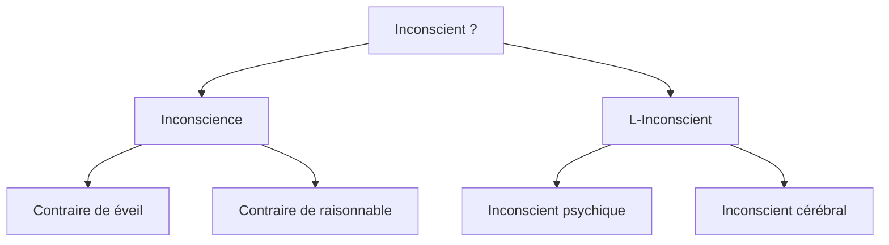

# 3. Je est un autre
{: .no_toc }

<details open markdown="block">
  <summary>
    Sommaire
  </summary>
  {: .text-delta }
- TOC
{:toc}
</details>

```
NOTIONS PRINCIPALES : L'INCONSCIENT, LA CONSCIENCE
```

---

> « *Car **Je est un autre**. Cela m’est évident : j’assiste à l’éclosion de ma pensée : je la regarde, je l’écoute : je lance un coup d’archet : la symphonie fait son remuement dans les profondeurs, ou vient d’un bond sur la scène.* »  
  (Arthur Rimbaud)

---

> « *Le moi n'est pas maître dans sa propre maison*. »  
> (Sigmund Freud)

---

## 3.1. Qu’est-ce que l’inconscient ?




{: .highlight }
→ Ouvrir la [carte mentale sur l'Inconscient](https://profauda.fr/schemas/cartes/inconscient.html){:target="_blank" } 

## 3.2. Le moi n'est pas maître dans sa propre maison


| Sigmund Freud, _Métapsychologie_ (1915)       |
| ------------------------------------------------ |
| **[#1]** On nous conteste de tous côtés le droit d’admettre un psychique inconscient et de travailler scientifiquement avec cette hypothèse. Nous pouvons répondre à cela que l’hypothèse de l’inconscient est nécessaire et légitime, et que nous possédons de multiples preuves de l’existence de l’inconscient.  <br>**[#2]** Elle est nécessaire, parce que les données de la conscience sont extrêmement lacunaires ; aussi bien chez l’homme sain que chez le malade, il se produit fréquemment des actes psychiques qui, pour être expliqués, présupposent d’autres actes qui, eux, ne bénéficient pas du témoignage de la conscience. Ces actes ne sont pas seulement les actes manqués et les rêves, chez l’homme sain, et tout ce qu’on appelle symptômes psychiques et phénomènes compulsionnels chez le malade ; notre expérience quotidienne la plus personnelle nous met en présence d’idées qui nous viennent sans que nous en connaissions l’origine et de résultats de pensée dont l’élaboration nous est demeurée cachée. Tous ces actes conscients demeurent incohérents et incompréhensibles si nous nous obstinons à prétendre qu’il faut bien percevoir par la conscience tout ce qui se passe en nous en fait d’actes psychiques ; mais ils s’ordonnent dans un ensemble dont on peut montrer la cohérence, si nous interpolons les actes inconscients inférés.  <br>**[#3]** Or, nous trouvons dans ce gain de sens et de cohérence une raison, pleinement justifiée, d’aller au-delà de l’expérience immédiate. Et s’il s’avère de plus que nous pouvons fonder sur l’hypothèse de l’inconscient une pratique couronnée de succès, par laquelle nous influençons, conformément à un but donné, le cours des processus conscients, nous aurons acquis, avec ce succès, une preuve incontestable de l’existence de ce dont nous avons fait l’hypothèse.  <br>**[#4]** L’on doit donc se ranger à l’avis que ce n’est qu’au prix d’une prétention intenable que l’on peut exiger que tout ce qui se produit dans le domaine psychique doive aussi être connu de la conscience. |
| *1. **[1] et [4]** : Freud répond à une critique (l’antithèse du texte) par une affirmation (thèse).<br>- Formulez l’antithèse<br>- Formulez la thèse de Freud et expliquez ce qu’il veut dire lorsqu’il affirme qu’elle est “nécessaire” et “légitime”<br>2. **[2]** : Freud avance un premier argument, théorique, en faveur de sa thèse. Expliquez-le<br>3. **[3]** : Freud avance un second argument, pratique. Expliquez-le.<br>- A partir de ces deux arguments, proposez une définition de la psychanalyse.*       |


