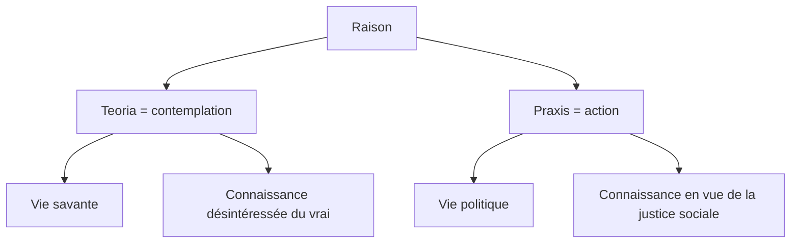

# 1. Qu’est-ce que le bonheur ?

```
NOTIONS PRINCIPALES : LE BONHEUR ET LA RAISON
```

:::note
BONHEUR (définition)

Mot formé en français de "*bon*" (contraire de mauvais) et de "*heur*" (sort, fatalité, destin).   
Le bonheur est donc, littéralement, le contraire du mauvais sort, de la malchance : il est un événement favorable, chanceux.
:::
## 1.1. Quand serons-nous heureux ?

> « *Ne proclamons heureux nul homme avant sa mort* »  
> (Sophocle)

:::tip
**Exercice** 

Expliquez la citation précédente en répondant à ces questions :   
1. Pourquoi le bonheur doit-il être “proclamé” ? Cela signifie-t-il que le bonheur est : une sensation ? un sentiment ? une idée ?   
2. Pourquoi faut-il attendre la mort d’un être humain pour le “proclamer heureux” ? Quels sont les deux sens possibles de cette affirmation ? Et lequel de ces deux sens est, selon vous, le bon ?
:::

## 1.2. Qui veut être heureux ?

> « *Tous les hommes recherchent d’être heureux. Jusqu’à ceux qui vont se pendre.* »   
> (Blaise Pascal)

Exercice : Expliquez la citation précédente. Que nous dit-elle du bonheur ?

## 1.3. Raison et bonheur

### Qu'est-ce que la raison ?

> « *Le bon sens est la chose du monde la mieux partagée.* »   
 (René Descartes)

:::note
**Exercice n°1** 

**Expliquez la citation précédente en répondant à ces deux questions :**   
1. Qu'est-ce que le "bon sens" ? (Aide : chercher des situations dans lesquelles on pourrait dire : « C'est une question de bon sens »)
2. Que veut dire Descartes lorsqu'il affirme que le bon sens est « la chose du monde la mieux partagée. » ? Partagée entre qui ? Partagée comment ?
:::
:::important
**Exercice n°2**    

**“Rationnel”** et **”Raisonnable”** sont deux mots formés avec la racine latine “ratio” (= “calcul”). Quels sont les deux sens du concept de “Raison” que ces deux mots impliquent ?
:::

:::note
EUDÉMONISME

Théorie selon laquelle le but d'une vie humaine est le bonheur, ou "*souverain bien*" (<u>bien</u> : ce que l'on recherche ; <u>souverain</u> : ce qui est au-dessus de tout, ce qui est la finalité dernière de toutes les actions).
:::

### Existe-t-il une seule manière d’atteindre le bonheur ?

  | ARISTOTE, *Éthique à Nicomaque* (IVe s. avant J.-C.) |  
  |---------------------------------|  
  | §1 - Les hommes, il ne faut pas s’en étonner, paraissent concevoir le bien et le bonheur d’après la vie qu’ils mènent. La foule des gens les plus grossiers disent que c’est le plaisir : c’est la raison pour laquelle ils ont une préférence pour la vie de jouissance. C’est qu’en effet les principaux types de vie sont au nombre de trois : celle dont nous venons de parler, la vie politique, et en troisième lieu la vie contemplative. La foule se montre vraiment d’une bassesse d’esclave en optant pour une vie bestiale (...). Les gens cultivés, et qui aiment la vie active, préfèrent l’honneur, et c’est là, à tout prendre, la fin de la vie politique. Mais l’honneur apparaît comme une chose trop superficielle pour être l’objet cherché, car de l’avis général, il dépend plutôt de ceux qui honorent que de celui qui est honoré, or nous savons d’instinct que le bien est quelque chose de personnel à chacun et qu’on peut difficilement nous ravir (...). Le troisième genre de vie, c’est la vie contemplative, dont nous entreprendrons l’examen par la suite. <br/>§2 - Quant à la vie de l’homme d’affaires, c’est une vie de contrainte, et la richesse n’est évidemment pas le bien que nous cherchons: c’est seulement une chose utile, un moyen en vue d’une autre chose. Aussi vaudrait-il encore mieux prendre pour fins celles dont nous avons parlé précédemment, puisqu’elles sont aimées pour elles-mêmes. |  
  | *1. Comment les gens conçoivent-ils en général le bonheur ?* <br/> *2. Aristote dénombre trois genres de vie, chacun visant à obtenir le bonheur : <br/>- Nommez ces trois genres de vie <br/>- Lequel peut nous procurer le plus de bonheur ?<br/>- Pourquoi les 2 autres genres de vie sont-ils imparfaits ? Quels sont les arguments d'Aristote ?  <br/>3. Dans le §2, Aristote aborde un dernier genre de vie :<br/>- De quel genre de vie s'agit-il ?<br/>- Pourquoi ne peut-il pas rendre heureux ?* <br/> *4. En vous aidant de la fiche [→ "Aristote : le souverain bien, les trois genres de vie et les 3 âmes"](https://drive.google.com/open?id=1xL8A1yZ1ZbJrEbMplrWbrHwT-Ob_Z-Sh&usp=drive_fs), expliquez pourquoi le bonheur n’est accessible que grâce à la raison.* |  
### Complément : raison théorique et pratique, vie contemplative et vie politique



:::note
LA RAISON

→ Ouvrir la [carte mentale sur la Raison](https://profauda.fr/schemas/cartes/raison.html)
:::
## Synthèse

**Exercice** : à l’aide d’une carte mentale, résumez les différents sens du concept de Bonheur.