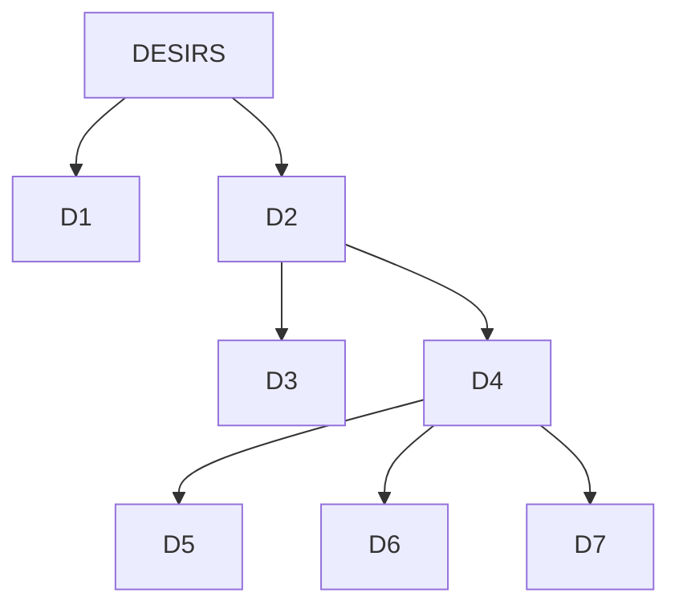

import useBaseUrl from '@docusaurus/useBaseUrl';

# 3. Peut-on prendre du plaisir raisonnablement ?

```
NOTIONS PRINCIPALES : LE BONHEUR ET LA RAISON
```

## 3.1.  Le paradoxe du désir

:::note
**Désir (définition)**

Le désir est en général conçu comme l’expression d’un *manque*, voire d'une douleur. Le mot vient du langage antique des oracles où il désigne l’absence d’une étoile (le latin *siderius*) dans le ciel. On distingue le désir du *besoin* (qui appelle une satisfaction urgente) et de la *volonté*  (qui implique un choix conscient). Le but du désir est la satisfaction (combler le manque), et cette satisfaction se manifeste par du plaisir (si je désire voyager, ce désir est un manque, jusqu'à ce qu'il soit satisfait : le manque sera comblé et cela me procurera du plaisir).
:::
:::important
**Ascétisme (définition)**

Doctrine morale qui prescrit de limiter au maximum ses désirs et de rejeter les plaisirs afin d’atteindre la perfection morale.
:::
  | Arthur Schopenhauer, *Le Monde comme volonté et comme représentation* (1818) |  
  |-------------------------------------------------------------------------|  
  | Tout désir naît d'un manque, d'un état qui ne nous satisfait pas ; donc il est souffrance, tant qu'il n'est pas satisfait. Or, nulle satisfaction n'est de durée ; elle n'est que le point de départ d'un désir nouveau. Nous voyons le désir partout arrêté, partout en lutte, donc toujours à l'état de souffrance ; pas de terme dernier à l'effort ; donc pas de mesure, pas de terme à la souffrance […] <br/> Mais que la volonté vienne à manquer d'objet, qu'une prompte satisfaction vienne à lui enlever tout motif de désirer, et les voilà tombés dans un vide épouvantable, dans l'ennui ; leur nature, leur existence, leur pèse d'un poids intolérable. La vie donc oscille, comme un pendule, de droite à gauche, de la souffrance à l'ennui ; ce sont là les deux éléments dont elle est faite, en somme. |  
  | *1. Expliquez en quoi le désir est un cercle vicieux. Faites une carte mentale pour le visualiser.* <br/> *2. Quel problème pose la définition du désir de Schopenhauer en ce qui concerne notre quête de bonheur ?* <br/> *3. Pourquoi l’ascétisme pourrait-il permettre de résoudre ce problème ?* <br/> *4. « On aime mieux la chasse que la prise. » (Blaise Pascal) En quoi cette citation contredit-elle la thèse de Schopenhauer ?* |  
## 3.2. La sagesse, voie vers le bonheur ?

:::tip
**Hédonisme (définition)**

Ne pas confondre avec l'*eudémonisme* !  L'hédonisme est une doctrine philosophique qui fait de la recherche du plaisir (*hédoné* en grec) le but de l'existence et le meilleur moyen de vivre heureux.
:::

**Épicure, *Lettre à Ménécée* (IV°-III° s. avant J.-C.)**   

  | Texte n°1 |  
  |------------------------------------------------|  
  | C’est pourquoi nous disons que le plaisir est le commencement et la fin de la vie heureuse. En effet, d’une part, le plaisir est reconnu par nous comme le bien primitif et naturel, et c’est lui qui donne naissance à tout choix et à toute aversion ; d’autre part, c’est toujours à lui que nous aboutissons, puisque ce sont nos affections [\*] qui nous servent de règle pour mesurer et apprécier tout bien quelconque si complexe qu’il soit. Mais, précisément parce que le plaisir est le bien primitif et naturel, nous ne recherchons pas tout plaisir, et il y a des cas où nous passons par-dessus beaucoup de plaisirs, savoir lorsqu’ils doivent avoir pour suite des peines qui les surpassent ; et, d’autre part, il y a des douleurs que nous estimons valoir mieux que des plaisirs, savoir lorsque, après avoir longtemps supporté les douleurs, il doit résulter de là pour nous un plaisir qui les surpasse.<br/>[\*] Affection : synonyme de sensation. |  
  | *1. La thèse de cet extrait est que* « le plaisir est le commencement et la fin de la vie heureuse ». *Qu'est-ce que cela signifie ?* *<br/>2. Comment Épicure justifie-t-il qu'il ne faut pas rechercher le plaisir à tout prix ?* |  
  | Texte n°2 |  
  |--------------------------------------------------|  
  | Il faut se rendre compte que parmi nos désirs les uns sont naturels, les autres vains et sans objet naturel, et que, parmi les désirs naturels, les uns sont nécessaires et les autres naturels seulement. Parmi les désirs nécessaires, les uns sont nécessaires pour le bonheur, les autres pour la tranquillité du corps, les autres pour la vie même. Et en effet une théorie non erronée des désirs doit rapporter tout choix et toute aversion à la santé du corps et à l’ataraxie [\*] de l’âme, puisque c’est là le double but auquel aspire la vie. Car nous faisons tout afin d’éviter la douleur physique et le trouble de l’âme. Lorsqu’une fois nous y avons réussi toute l’agitation de l’âme tombe, l’animal n’ayant plus à s’acheminer vers quelque chose qui lui manque, ni à chercher autre chose pour parfaire le bien de l’âme et celui du corps. Nous n’avons en effet besoin du plaisir que quand, par suite de son absence, nous éprouvons de la douleur ; et quand nous n’éprouvons pas de douleur nous n’avons plus besoin du plaisir. <br/>[\*] *Ataraxie* = tranquillité ou absence de trouble de l'âme. <br/> *Aponie* = santé ou absence de douleur du corps. |  
  | *1. Faites une carte mentale pour schématiser comment se divisent les différents genres de désirs selon Épicure* *<br/>2. Comment gérer nos désirs afin d’être heureux ?* |  


:::note
Faire [→ l'exercice suivant](../../docs/L1/L1-4-2.html)
:::
  | Texte n°3 |  
  |----------------------------------------------------|  
  | Et maintenant y a-t-il quelqu’un que tu mettes au-dessus du sage ? Il s’est fait sur les dieux des opinions pieuses ; il est constamment sans crainte en face de la mort ; il a su comprendre quel est le but de la nature ; il s’est rendu compte que ce souverain bien est facile à atteindre et à réaliser dans son intégrité, qu’en revanche le mal le plus extrême est étroitement limité quant à la durée ou quant à l’intensité (...) <br/>Médite donc tous ces enseignements et tous ceux qui s’y rattachent, médite-les jour et nuit, à part toi et aussi en commun avec ton semblable. Si tu le fais, jamais tu n’éprouveras le moindre trouble en songe ou éveillé, et tu vivras comme un dieu parmi les hommes. |  
  | *1. Cherchez dans ce texte les 4 préceptes du Tetrapharmakos. <br/> 2. Expliquez en quoi l’usage de la raison est, selon Épicure, le meilleur moyen de vivre heureux.* |  
### Le Tetrapharmakos

  

Le **Tetrapharmakos** (quadruple remède) est un ensemble de quatre préceptes philosophiques réglant la conduite épicurienne d'une vie heureuse. Le tetrapharmakos était à l’origine un remède composé de quatre médicaments (cire, suif, poix et résine) destiné à guérir les maux du corps et que l'épicurisme transpose aux maux de l'âme.

| Colonne 1 | Colonne 2 |
|---|---|
  | <div style={{textAlign: "center"}}><a href={useBaseUrl("/img/philo/tetrapharmakos.png")} target="_blank" rel="noopener noreferrer"></a></div> | **« Ne crains pas les dieux<br/>N’aies pas peur de la mort<br/>Le bonheur est facile à obtenir<br/>La souffrance est supportable »** |