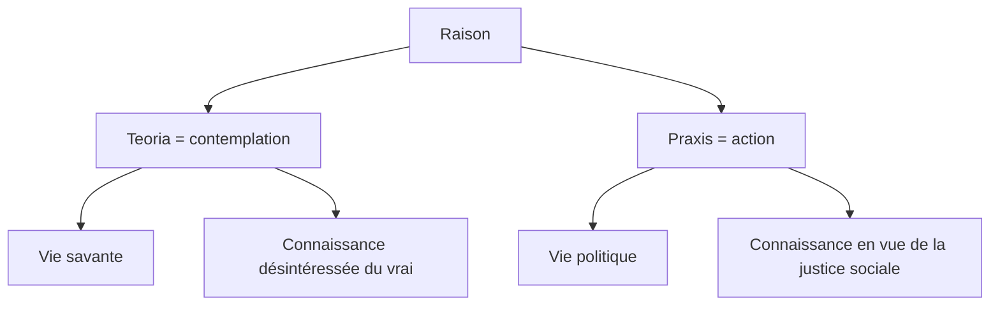

# 1. Existe-t-il une seule manière d’être heureux ?

:::warning[définitions]
- **<u>Eudémonisme</u>** - Théorie selon laquelle le bonheur est le "**souverain bien**", c’est-à-dire le but, la finalité de toute existence humaine (bien = ce que l'on recherche ; souverain = ce qui est au-dessus de tout, ce qui commande, gouverne). 
- **<u>Contemplation</u>** 
  - <u>Sens 1</u> : fait d’observer attentivement quelque chose. 
  - <u>Sens 2</u> : état de l'esprit qui s'applique profondément à un objet intellectuel, état de l'âme qui se donne tout entière à la méditation.   
→ Contemplation se dit en grec *teorìa*, qui a donné en français **théorie** (savoir spéculatif, connaissance purement intellectuelle).
- **<u>Raison</u>**    
  - <u>Sens 1</u> : capacité à réfléchir rationnellement, à distinguer le vrai du faux. 
  - <u>Sens 2</u> : capacité à agir de manière raisonnable, à distinguer le bien du mal.
:::

:::info[NOTION DU PROGRAMME : LA RAISON]  
→ Ouvrir la [carte mentale sur la Raison](https://profauda.fr/schemas/cartes/raison.html)
:::

| ARISTOTE, *Éthique à Nicomaque* (IVe s. avant J.-C.) |  
  |---------------------------------|  
  | §1 - Les hommes, il ne faut pas s’en étonner, paraissent concevoir le bien et le bonheur d’après la vie qu’ils mènent. La foule des gens les plus grossiers disent que c’est le plaisir : c’est la raison pour laquelle ils ont une préférence pour la vie de jouissance. C’est qu’en effet les principaux types de vie sont au nombre de trois : celle dont nous venons de parler, la vie politique, et en troisième lieu la vie contemplative. La foule se montre vraiment d’une bassesse d’esclave en optant pour une vie bestiale (...). Les gens cultivés, et qui aiment la vie active, préfèrent l’honneur, et c’est là, à tout prendre, la fin de la vie politique. Mais l’honneur apparaît comme une chose trop superficielle pour être l’objet cherché, car de l’avis général, il dépend plutôt de ceux qui honorent que de celui qui est honoré, or nous savons d’instinct que le bien est quelque chose de personnel à chacun et qu’on peut difficilement nous ravir (...). Le troisième genre de vie, c’est la vie contemplative, dont nous entreprendrons l’examen par la suite.  §2 - Quant à la vie de l’homme d’affaires, c’est une vie de contrainte, et la richesse n’est évidemment pas le bien que nous cherchons: c’est seulement une chose utile, un moyen en vue d’une autre chose. Aussi vaudrait-il encore mieux prendre pour fins celles dont nous avons parlé précédemment, puisqu’elles sont aimées pour elles-mêmes. |  
  | *1. Aristote dénombre trois genres de vie, chacun visant à obtenir le bonheur :  a) Nommez ces trois genres de vie  b) Lequel peut nous procurer le plus de bonheur ? c) Pourquoi les 2 autres genres de vie sont-ils imparfaits ? Quels sont les arguments d'Aristote ?   2. Dans le §2, Aristote aborde un dernier genre de vie : a) De quel genre de vie s'agit-il ? b) Pourquoi ne peut-il pas rendre heureux ?*   *3. En vous aidant de la fiche "**Aristote : le souverain bien, les trois genres de vie et les 3 âmes**", expliquez pourquoi le bonheur n’est accessible que grâce à la raison.* |  

### Complément : raison théorique et pratique, vie contemplative et vie politique

:::info
Voir les repères conceptuels [*en théorie – en pratique*](/manuel/Repères/theorie)
:::

