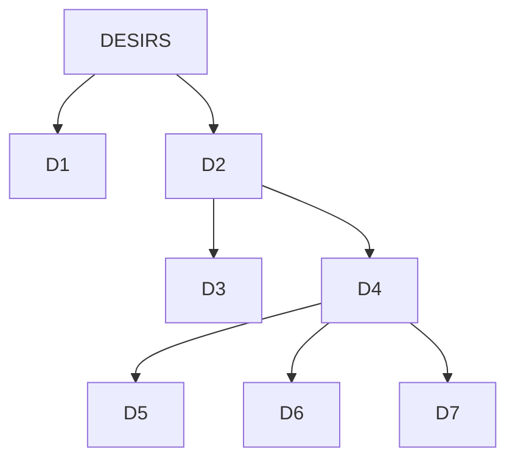

import useBaseUrl from '@docusaurus/useBaseUrl';

# Extraits de la *Lettre à Ménécée* 
**(ÉPICURE, IVe s. avant J.-C.)**

## Textes

| TEXTE N°1 : pourquoi il faut toujours philosopher |  
|------------------------------------------------|  
| Un jeune homme ne doit point différer de se mettre à la philosophie ; mais un vieillard ne doit pas non plus s’en lasser ; car, qui que l’on soit, il n’est jamais ni trop tôt ni trop tard pour prendre soin de son âme. Celui qui dit que le moment n’est pas encore venu de philosopher, ou que ce moment est passé est comparable à quelqu’un qui dirait que le moment du bonheur n’est pas encore venu, ou qu’il n’en est plus temps. Qu’on soit jeune ou qu’on soit vieux, il faut philosopher : dans ce dernier cas, c’est pour vivre une nouvelle jeunesse comblée de biens, en prenant de l’âge, mais enchanté par le souvenir du passé ; et dans le premier cas, c’est pour jouir en même temps, encore jeune, des avantages de la jeunesse et de ceux de l’âge en s’épargnant la crainte de l’avenir. Car il faut s’instruire de ce qui produit le bonheur : quand on le possède, nous n’avons besoin de rien de plus ; quand il est absent, nous n’épargnons aucun effort pour l’obtenir.  |  
| *1. Expliquez pourquoi, selon Épicure, les jeunes comme les vieux doivent faire de la philosophie.   2. Quel est le but de la philosophie, selon Épicure ?* |  

| TEXTE N°2 : comment gérer ses désirs afin d’être heureux |  
|--------------------------------------------------|  
| Nous devons nous servir du raisonnement pour comprendre aussi, que parmi nos désirs, les uns sont naturels, les autres vains, et que, parmi les désirs naturels, les uns sont nécessaires, les autres seulement naturels. Parmi les désirs nécessaires, les uns sont nécessaires au bonheur, les autres à la bonne santé du corps, d’autres à la vie elle-même. Un examen fort simple de ces désirs enseigne que tout ce que nous recherchons et fuyons se ramène à la santé du corps et à la tranquillité de l’âme(1), puisque c’est là le but de la vie heureuse. Car tout ce que nous faisons, nous le faisons en effet à cette fin : ne pas souffrir et ne pas être en proie à l’inquiétude.   (…)   Nous pensons que se suffire à soi-même est un grand bien, non pas qu’il s’agisse de toujours vivre de peu, mais parce qu’il faut être capable de se contenter de peu si l’abondance fait défaut (…). Et de la même façon, nous sommes persuadés qu’il est facile de se procurer tout ce qui est naturel, et difficile ce qui est vain. Des mets simples apportent bien la même satisfaction qu’une table somptueuse s’il ne s’agit que de faire disparaître la douloureuse sensation de la faim. (…) Ainsi, lorsque nous disons que la fin suprême est le plaisir, nous ne parlons pas des plaisirs du débauché, ni de ceux qui résident dans la jouissance (…) ; par plaisir nous entendons l’absence de douleur pour le corps, et de trouble pour l’âme.   *(1) La tranquillité de l’âme (quiétude), ou absence de trouble de l'âme, si dit en grec ataraxie, définition classique du bonheur.*  |  
| *1. Faites une carte mentale pour schématiser comment se divisent les différents genres de désirs selon Épicure   2. En quoi cette classification permet de comprendre comment atteindre le bonheur ?  3. Qu’est-ce que « se suffire à soi-même » ?   4. Comment Épicure définit-il le plaisir ?  5. Proposez une définition du bonheur selon Épicure.* |  

:::note[complément]
Faire [→ l'exercice suivant](../2-2-1/2-2-2-1/)
:::

## Interview d'Épicure par Mr Phi !

<iframe width="560" height="315" src="https://www.youtube.com/embed/fFyveQxiyEE?si=bsFngu_dCnnML2Nu" title="YouTube video player" frameborder="0" allow="accelerometer; autoplay; clipboard-write; encrypted-media; gyroscope; picture-in-picture; web-share" referrerpolicy="strict-origin-when-cross-origin" allowfullscreen></iframe>