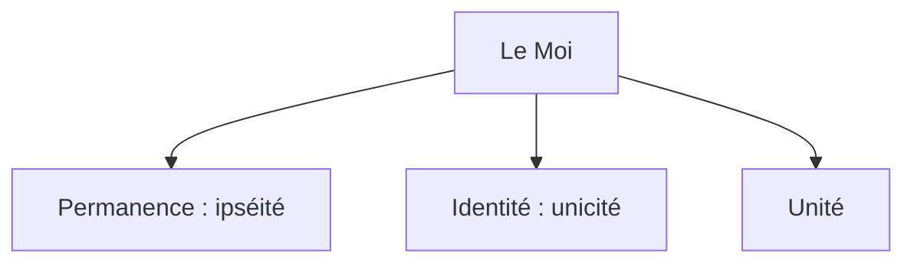

# Introduction : Le problème de l'identité personnelle

```
NOTION PRINCIPALE : LA CONSCIENCE
```

## Le paradoxe du bateau de Thésée


| Plutarque (46 – 125), _Vie de Thésée_ |  
|--------------------------------|  
| Le vaisseau sur lequel Thésée s’était embarqué avec les autres jeunes gens, et qu’il ramena heureusement à Athènes, était une galère à trente rames, que les Athéniens conservèrent jusqu’au temps de Démétrios de Phalère. Ils en ôtaient les vieilles pièces, à mesure qu’elles se gâtaient, et les remplaçaient par des neuves qu’ils joignaient solidement aux anciennes. Aussi les philosophes, en se disputant sur ce genre de sophisme (…), citent ce vaisseau comme un exemple de doute, et soutiennent les uns que c’était toujours le même, les autres que c’était un vaisseau différent. |  
| *1. Selon vous, le nouveau bateau de Thésée est-il le même ou un bateau différent ? Justifiez. <br/> 2. Appliquez le paradoxe du bateau de Thésée à votre propre personne et formulez le problème de l’identité personnelle.* |  

***

<iframe src="https://www.youtube.com/embed/PWud6qbSwug?si=H6uTFIyyvDvC028y" width="100%" style={{aspectRatio: "560/315"}} frameborder="0" allowfullscreen allow="accelerometer; autoplay; clipboard-write; encrypted-media; gyroscope; picture-in-picture; web-share"></iframe>

***

<iframe src="https://www.youtube.com/embed/UHwVyplU3Pg?si=haBymrcR48sE2Htw" width="100%" style={{aspectRatio: "560/315"}} frameborder="0" allowfullscreen allow="accelerometer; autoplay; clipboard-write; encrypted-media; gyroscope; picture-in-picture; web-share"></iframe>

## Les caractéristiques du Moi



→ Ouvrir la [carte mentale sur l'identité du Moi](https://profauda.fr/schemas/cartes/moi.html)

## Identité, égalité et différence
→ Voir les repères [identité/égalité/différence](/manuel/Repères/identite)

