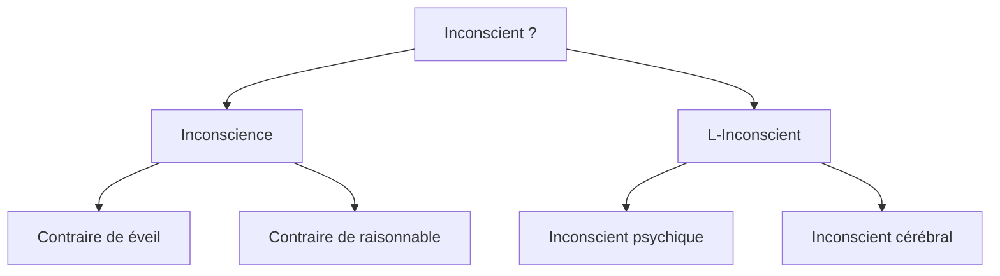

# 3. Je est-il un autre ?

import useBaseUrl from '@docusaurus/useBaseUrl';

```
NOTIONS PRINCIPALES : L'INCONSCIENT, LA CONSCIENCE
```

---

> « *Car **Je est un autre**. Cela m’est évident : j’assiste à l’éclosion de ma pensée : je la regarde, je l’écoute : je lance un coup d’archet : la symphonie fait son remuement dans les profondeurs, ou vient d’un bond sur la scène.* »  
  (Arthur Rimbaud)

---

> « *Le moi n'est pas maître dans sa propre maison*. »  
> (Sigmund Freud)

---

## Qu’est-ce que l’inconscient ?



→ Ouvrir la [carte mentale sur l'Inconscient](https://profauda.fr/schemas/cartes/inconscient.html) 

## 3.1. L'hypothèse de l'Inconscient psychique

| Sigmund Freud, _Métapsychologie_ (1915) |  
|------------------------------------------------|  
| **[§1]** On nous conteste de tous côtés le droit d’admettre un psychisme inconscient et de travailler scientifiquement avec cette hypothèse. Nous pouvons répondre à cela que l’hypothèse de l’inconscient est nécessaire et légitime, et que nous possédons de multiples preuves de l’existence de l’inconscient.  <br/>**[§2]** Elle est nécessaire, parce que les données de la conscience sont extrêmement lacunaires ; aussi bien chez l’homme sain que chez le malade, il se produit fréquemment des actes psychiques qui, pour être expliqués, présupposent d’autres actes qui, eux, ne bénéficient pas du témoignage de la conscience. Ces actes ne sont pas seulement les actes manqués et les rêves, chez l’homme sain, et tout ce qu’on appelle symptômes psychiques et phénomènes compulsionnels chez le malade ; notre expérience quotidienne la plus personnelle nous met en présence d’idées qui nous viennent sans que nous en connaissions l’origine et de résultats de pensée dont l’élaboration nous est demeurée cachée. Tous ces actes conscients demeurent incohérents et incompréhensibles si nous nous obstinons à prétendre qu’il faut bien percevoir par la conscience tout ce qui se passe en nous en fait d’actes psychiques ; mais ils s’ordonnent dans un ensemble dont on peut montrer la cohérence, si nous interpolons les actes inconscients inférés.  <br/>**[§3]** Or, nous trouvons dans ce gain de sens et de cohérence une raison, pleinement justifiée, d’aller au-delà de l’expérience immédiate. Et s’il s’avère de plus que nous pouvons fonder sur l’hypothèse de l’inconscient une pratique couronnée de succès, par laquelle nous influençons, conformément à un but donné, le cours des processus conscients, nous aurons acquis, avec ce succès, une preuve incontestable de l’existence de ce dont nous avons fait l’hypothèse.  <br/>**[§4]** L’on doit donc se ranger à l’avis que ce n’est qu’au prix d’une prétention intenable que l’on peut exiger que tout ce qui se produit dans le domaine psychique doive aussi être connu de la conscience. |  
| *1. **[§1] et [§4]** : Freud répond à une critique (l’antithèse du texte) par une affirmation (thèse) : formulez l’antithèse, puis formulez la thèse de Freud et expliquez ce qu’il veut dire lorsqu’il affirme qu’elle est “nécessaire” et “légitime” <br/>2. **[§2]** : Freud avance un premier argument, théorique, en faveur de sa thèse. Expliquez-le<br/>3. **[§3]** : Freud avance un second argument, pratique, en faveur de sa thèse. Expliquez-le.* |

:::info[Définitions]
- **Psychisme** : ensemble des activités de l’esprit, des états mentaux.
Inconscient : qui échappe à notre conscience, c’est-à-dire à notre connaissance.
- **Lacunaire** : incomplet.
- **Acte manqué** : action accomplie involontairement en apparence mais qui serait révélatrice d'une pulsion inconsciente. 
- **Rêve** : selon Freud, le rêve est l'accomplissement déguisé d'un désir inconscient et refoulé. 
- **Symptôme** : la partie visible d’une maladie ou d’un trouble mental, sa manifestation extérieure.
- **Phénomène compulsionnel** : comportement répétitif et maladif dont l’origine est inconsciente. Exemple : les TOC (Troubles Obsessionnels Compulsifs) : se laver les mains tout le temps, revenir fermer sa porte à clé plusieurs fois, etc.
:::

## 3.2. Le Moi, entre le Ça et le Surmoi

```
NOTION COMPLÉMENTAIRE : LE BONHEUR
```

>  « *Un adage nous déconseille de servir deux maîtres à la fois. Pour le pauvre Moi la chose est bien pire, il a à servir trois maîtres sévères et s'efforce de mettre de l'harmonie dans leurs exigences. Les trois despotes sont le monde extérieur, le surmoi et le ça.* »   
>  (S. Freud)

| LA SECONDE TOPIQUE DE FREUD : ÇA, MOI ET SURMOI | Illustration |
|---|---|
| **Freud distingue dans le psychisme humain trois parties : le « Ça », le « Moi » et le « Surmoi ».** <br/> •	Le **Ça** serait la partie inconsciente de notre psychisme, inaccessible à notre conscience. Le Ça, régi par le principe de plaisir* (« Jouis ! ») est peuplé de désirs inconscients refoulés* par le Surmoi et qui s’expriment indirectement dans le rêve (« accomplissement déguisé d’un désir refoulé ») et dans les comportements névrotiques*. Le Ça fait pression sur le Moi pour qu’il assouvisse ces pulsions* interdites. <br/> •	Le **Moi**, conscient, est le socle de la personnalité, la partie rationnelle de notre psychisme, régie par le principe de réalité* (« Sois sage ! » : accepte le réel tel qu’il est). Il doit concilier les exigences contradictoires du Ça, qui veut qu’il réalise ses pulsions inconscientes, et du Surmoi, qui refoule* ces pulsions dans le Ça, et tente d’en empêcher leur réalisation. Le Moi est donc prisonniers de deux ordres contradictoires : Toujours jouir / Ne jamais prendre de plaisir. <br/> •	Le **Surmoi**, en partie inconscient, est le juge intérieur qui naît de l’intériorisation des interdits sociaux, dont les deux grands tabous* universels de l’humanité : le parricide et l’inceste. Le Surmoi censure les désirs du Ça, tente de les empêcher d’accéder à la conscience. Il veille notamment à interdire la réalisation du complexe d’Œdipe (désir de la mort du père et de la possession de la mère chez le garçon, version psychique des deux grands tabous de la civilisation). | <div style={{textAlign: 'center', minWidth: '250px'}}><a href={useBaseUrl('/img/philo/topique.jpg')} target="_blank"></a></div>| 

:::info[définitions]
- **Principe de plaisir** : principe qui régule notre activité psychique en lui imposant d'éviter toute douleur et, à l’inverse, de se procurer le maximum de plaisir.
- **Principe de réalité** : principe qui régule notre activité psychique en lui imposant de refuser de satisfaire ses pulsions pour se plier aux exigences du monde extérieur.
- **Pulsion** : force inconsciente qui, agissant de façon permanente, suscite en nous une certaine conduite. Freud considère qu’il y a deux grandes pulsions fondamentales qui régissent notre vie psychique : les pulsions de vie (« Éros », pulsions sexuelles) et les pulsions de mort (« Thanatos », pulsions sadiques, destructives).
- **Névrose** : trouble du comportement dont a conscience le patient et qui a une cause psychique. À distinguer de la psychose, dans laquelle le patient n'a pas conscience de ses troubles et perd contact avec la réalité.
- **Refoulement** : mécanisme de défense inconscient qui consiste à repousser les pulsions interdites dans le Ça. 
- **Tabou** : acte interdit car touchant au sacré et dont la transgression est susceptible d'entraîner un châtiment divin. Dans « Totem et Tabou », Freud affirme que l’humanité est passée de l’état de nature à la civilisation en mettant fin à deux pratiques courantes dans les meutes préhumaines : le meurtre du père (parricide) et l’inceste entre frères et sœurs. Mais il pense que ces interdits demeurent sous formes de pulsions dans le Ça de tout individu, d’où le complexe d’Œdipe qui serait présent universellement chez les enfants.
:::

| Le complexe d'Œdipe ([Philosophie Magazine](https://www.philomag.com/articles/la-cle-des-songes)) |
| --- |
|« Dans sa pièce « Œdipe roi », Sophocle retrace le mythe d’Œdipe, qui aurait à son insu tué son père et épousé sa mère, avant de se crever les yeux en découvrant la vérité. C’est pourquoi Freud nomme Complexe d’Œdipe le stade psychosexuel au cours duquel l’enfant développe un désir pour le parent du sexe opposé et une agressivité à l’égard du parent du même sexe, perçu comme un rival. Chez le petit garçon, cela peut conduire au désir d’épouser la mère et de prendre la place du père. Mais cette configuration est pour l’enfant une source d’angoisse : il craint fantasmatiquement la castration comme punition pour son désir incestueux et son hostilité. La menace de punition force l’enfant à surmonter, de façon plus ou moins réussie, ce complexe.  <br/> (…) Pour la petite fille, l’ordre s’inverse : elle connaît d’abord le complexe de castration et entre ensuite dans l’Œdipe, qui se traduit par le désir d’avoir un enfant du père. Conscient des différences entre l’Œdipe masculin et féminin, Freud refuse l’idée de complexe d’Électre, qui introduit une fausse symétrie entre les deux sexes. L’universalité de l’Œdipe pose pourtant question : n’est-il pas indissociable d’un modèle culturel et d’une conception nucléaire de la famille ? » |

  